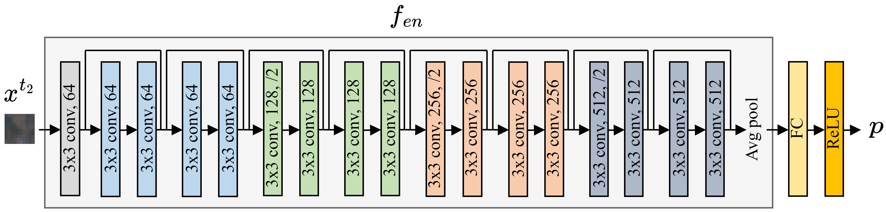
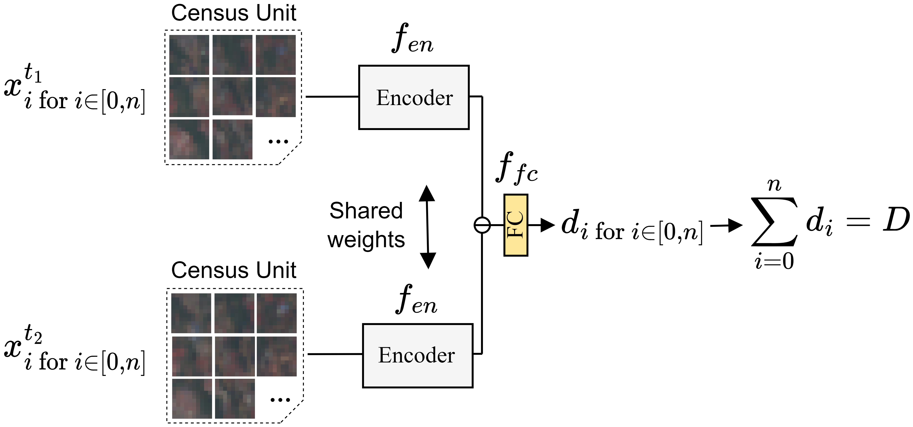

# Predicting Urban Population Growth from Sentinel-2 MSI and Census Data using Deep Learning: A Case Study in Kigali, Rwanda

To better understand current trends of urban population growth in Sub-Saharan Africa, high-quality spatiotemporal population estimates are necessary. While the joint use of remote sensing and deep learning has achieved promising results for population distribution estimation, most of the current work focuses on fine-scale spatial predictions derived from single date census, thereby neglecting temporal analyses. In this work, we focus on evaluating how deep learning change detection techniques can unravel temporal population dynamics at short intervals. Since Post-Classification Comparison (PCC) methods for change detection are known to propagate the error of the individual maps, we propose an end-to-end population growth mapping method. Specifically, a ResNet encoder, pretrained on a population mapping task with Sentinel-2 MSI data, was incorporated into a Siamese network. The Siamese network was trained at the census level to accurately predict population change. The effectiveness of the proposed method is demonstrated in Kigali, Rwanda, for the time period 2016--2020, using bi-temporal Sentinel-2 data. Compared to PCC, the Siamese network greatly reduced errors in population change predictions at the census level. These results show promise for future remote sensing-based population growth mapping endeavors.

# The proposed method

Population mapping using a ResNet-18 encoder (trained at the grid level)


Population growth mapping using a Siamese network that incorporates the pretrained encoder (trained at the census level)


# Replicating our results

## 1 Download the data

The dataset is available on Zenodo:

[](https://doi.org/10.5281/zenodo.7712047)


Furthermore, our trained models are available on Google Drive

[Trained models](https://tinyurl.com/423jzj32)


## 2 Network training

Important: We use [Weights & Biases](https://wandb.ai/site) for logging during training. Therefore, a Weights & Biases account is required in order to run our training files.


### Population mapping at the grid level

To train the ResNet-18 encoder for population mapping (used for pretraining), run the ``train_superised.py`` as follows:

````
python train_supervised.py -c popmapping -o 'path to output directory' -d 'path to data directory' -p 'w&b project name'
````


### Population growth mapping at the census level

To train the Siamese network for population growth mapping, run the ``train_weaklysuperised.py``:


````
python train_weaklysupervised.py -c popgrowthmapping_pretrained -o 'path to output directory' -d 'path to data directory' -p 'w&b project name'
````


## 3 Inference and assessment

We provide functions to evaluate the population mapping and population growth mapping results.

First, run the file ``inference.py`` to produce a population growth map and the quantitative results for a given config:
 
 ````
 python inference.py -c 'config name (popmapping/popgrowthmapping_pretrained)' -o 'path to output directory' -d 'path to data directory'
 ````
 
Then, run the file``assessment.py`` to quantitative and qualitative assess network performance: for .

 ````
 python assessment.py -c 'config name (popmapping/popgrowthmapping_pretrained)' -o 'path to output directory' -d 'path to data directory'
 ````


# Credits

If you find this work useful, please consider citing the paper:


  ```bibtex

  ```

or the dataset:

  ```bibtex
  @dataset{hafner_sebastian_2023_7712047,
  author       = {Hafner, Sebastian and Georganos, Stefanos and Mugiraneza, Theodomir},
  title        = {PopulationGrowthDataset\_Kigali},
  month        = mar,
  year         = 2023,
  publisher    = {Zenodo},
  version      = {version 1},
  doi          = {10.5281/zenodo.7712047},
  url          = {https://doi.org/10.5281/zenodo.7712047}
}
  ```